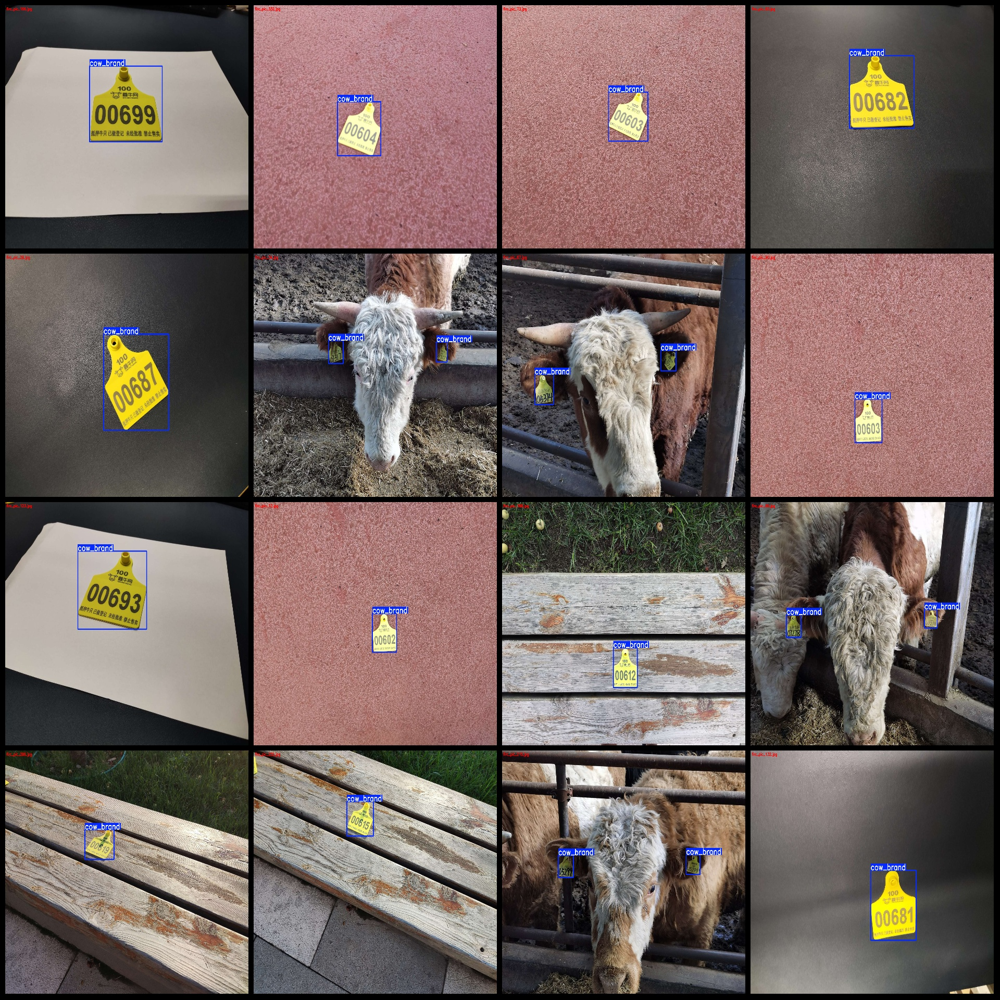
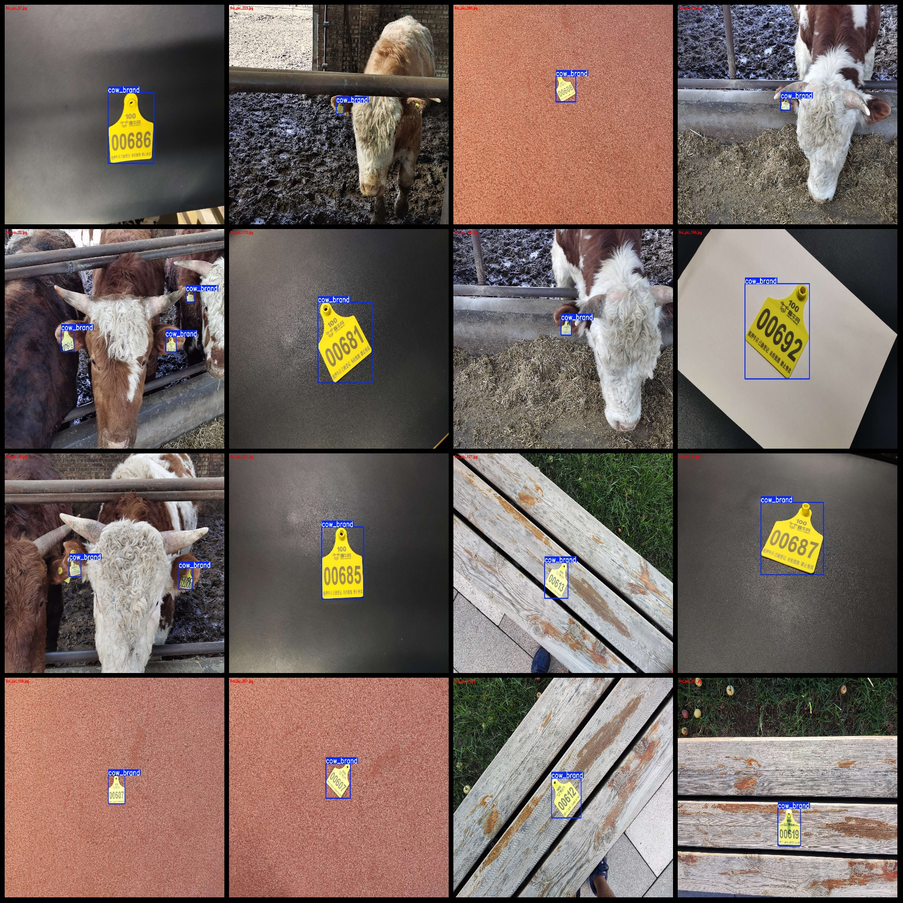

# Dairy Cow Ear Tag Detection Dataset in VOC+YOLO Format with 334 Images in One Class

Dataset format: Pascal VOC format+YOLO format (without split path's txtfile, just contain jpgimage and corresponding VOC format.xmlfile and yolo format.txtfile)
Number of images (jpg file count): 334
annotation count: 334  
annotation count: 334  
annotationnumber of classes: 1  
Label Category Name: ["cow_brand"]
Number of bounding boxes per category:
"cow_brand" is a word.
total boxes: 369  
images per class:   
cow_brand images = 334  
image resolution: 1920x1440  
Use annotation tool: labelImg
Annotation rules: Draw a rectangle around the class for each instance.
Important notes: The dataset does not have a separate training, validation, and test set. You need to manually split it.
Special Notice: This dataset does not guarantee the accuracy of the trained model or weight files.
Image preview:
## Images

Here is a pay link on Stripe ( https://buy.stripe.com/3cs8yP7sY87d0vu9AB ). Please contact me lonlonago@foxmail.com after funding $89, and I will send you a complete data files , thank you!

